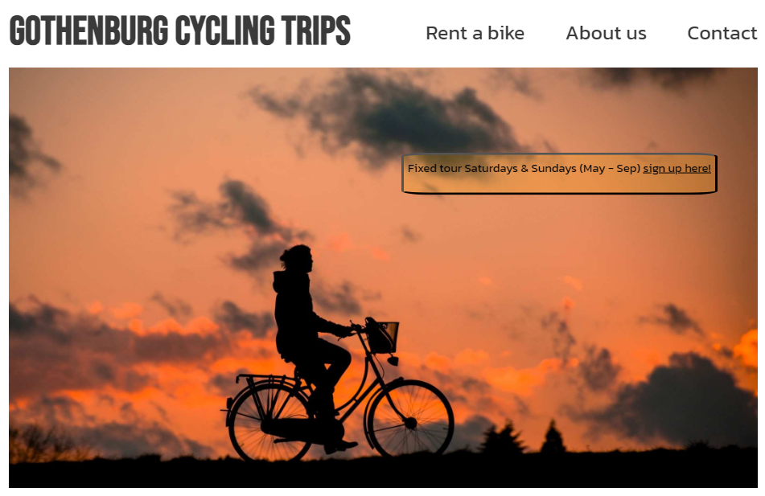

# GOTHENBURG CYCLING TRIPS

View an example of this section [here](https://github.com/kera-cudmore/Bully-Book-Club#bully-book-club-website)

Gothenburg cycling trips is offering bike tours inGothenburg city (Sweden), the background for creating this site is to promote an environmentally friendly and easy way to explore Gothenburg city for tourists or anyone enjoying bicycling. Furthermore, the target group could be anyone newly moved to Gothenburg wishing to make new acquaintances and would suit well for team-activities.

Add an image of the finished site here. I like to use [amiresponsive](https://ui.dev/amiresponsive) to get an image of my site on all device sizes, and amiresponsive allows you to click links on the page and scroll, so each device can show a different element of your site.

Add a link to the live site here, for Milestone 1 this will be the GitHub Pages Link from when you deployed the site.

If you want to add optional [shields.io](https://shields.io) badges to your README, I like to add them to this section.

## CONTENTS

- [GOTHENBURG CYCLING TRIPS](#gothenburg-cycling-trips)
  - [CONTENTS](#contents)
  - [User Experience (UX)](#user-experience-ux)
    - [User Stories](#user-stories)
  - [Design](#design)
    - [Colour Scheme](#colour-scheme)
    - [Typography](#typography)
    - [Imagery](#imagery)
    - [Wireframes](#wireframes)
  - [Features](#features)
    - [Main page](#main-page)
    - [Navigation bar](#navigation-bar)
  - [The tour description section](#the-tour-description-section)
  - [About us](#about-us)
  - [Fixed tour sign up form](#fixed-tour-sign-up-form)
  - [Rent a bike](#rent-a-bike)
  - [Contact](#contact)
    - [Gothenburg city tour map](#gothenburg-city-tour-map)
      - [Vasastan](#vasastan)
      - [Haga/Järntorget](#hagajärntorget)
      - [Lindholmen](#lindholmen)
      - [Eriksberg](#eriksberg)
      - [Karlatornet](#karlatornet)
      - [Hisingsbron](#hisingsbron)
      - [Göteborgsoperan](#göteborgsoperan)
  - [About us](#about-us-1)
  - [Fixed tour sign up form](#fixed-tour-sign-up-form-1)
  - [Rent a bike](#rent-a-bike-1)
  - [Contact](#contact-1)
    - [General features on each page](#general-features-on-each-page)
    - [Future Implementations](#future-implementations)
    - [Accessibility](#accessibility)
  - [Technologies Used](#technologies-used)
    - [Languages Used](#languages-used)
    - [Frameworks, Libraries \& Programs Used](#frameworks-libraries--programs-used)
  - [Deployment \& Local Development](#deployment--local-development)
    - [Deployment](#deployment)
    - [Local Development](#local-development)
      - [How to Fork](#how-to-fork)
      - [How to Clone](#how-to-clone)
  - [Testing](#testing)
  - [Credits](#credits)
    - [Code Used](#code-used)
    - [Content](#content)
    - [ Media](#media)
    - [Acknowledgments](#acknowledgments)

---

 

- __The Footer__

  - The footer section includes links to the relevant social media sites for Love Running. The links will open to a new tab to allow easy navigation for the user.
  - The footer is valuable to the user as it encourages them to keep connected via social media

## User Experience (UX)

👩🏻‍💻 View an example of a completed user experience section [here](https://github.com/kera-cudmore/Bully-Book-Club#user-experience-ux)

### User Stories

- __First time user:__
    I am:
  - Appreciating the website with a first impression of a well balanced layout for information
  - Understanding the websites purpose and what services it offer.
  - Easy navigation and easy to acess the primarily functions.

-__Returning User:__
   I am: 
- Establishing personal contact and should be able to give input
- A sence of flexibility, bike can be rented with other price for larger groups - in order to fit the desciption "about us". for easy access to 
- As described in the about section
- Also adding inof in meta characteristic for customized trips

## Design

👩🏻‍💻 View an example of a completed design section [here](https://github.com/kera-cudmore/earth-day-hackathon-2022#Design)

### Colour Scheme

The landing page is the primary colour contributor to the website, hence the background is white in order the enhance the dominant colours in the hero image which is representing the long nordic summer sunsets.

One of the main colours used in the hero image (#252621) was re-used for the footer as well, the colour is still clearly marks a distinct difference compared to the contact section above it but still keeping the theme consistent with the landing page.

I like to include a palette of the colour scheme here, my favourite site for creating a colour palette is [coolors](https://coolors.co/), 

### Typography

The fonts chosen for the project is Babas Neue and Kanit with sans-serif as back up, these fonts are distinct but still with a soft edge matching the landing page content. 

These fonts were imported with google fonts [Google Fonts](https://fonts.google.com/) 

Kanit: for all content except the header title element (h1)
Babas Neue: for Header (h1)

### Imagery

The imagery is fundamental aspect forthe site, since the service provided is primarly bike tours, various images from the tour were included to let the user being able to properly view the main parts of the route thus improving the experience overall.

Images:
- Landing page and rent a bike section are from pexelbay
- The gothenburg city map is from open street map
- All other pictures are taken by myself

### Wireframes

Add the images or links for your wireframes here.

There are lots of different options to create your wireframes - Code Institute students can access [Balsamiq](https://balsamiq.com/) as part of the course.
 Or you can even go old school and get those wireframes completed using pen and paper. Just snap an image of the completed wireframes to add the images to the README.

## Features

### Main page

- Fixed tour sign up form

### Navigation bar

- Rent a bike
- About us
- Contact

## The tour description section

## About us

## Fixed tour sign up form

## Rent a bike

## Contact

👩🏻‍💻 View an example of a completed user experience section [here](https://github.com/kera-cudmore/TheQuizArms#Features)

This section can be used to explain what pages your site is made up of.

### Gothenburg city tour map

    - This is an overview of the bike route letting the user to see the different stops and the complete overview of the tour before seeing the different subsections described below.

#### Vasastan

- First section: describes the first part of the route, the image is showing a bike lane avenue in a nice surrounding giving a nice first impression of the tour.

#### Haga/Järntorget

- Second section,hte main purpose with this stop is to show the really old part of the city and the charateristic cobble stone streets letting the user to see history but as well possibility to check the cafees adn souvenir shops.

#### Lindholmen

- The trip to lindholmen with the ferry enriches the experience for the user, seing Gothenburg from the sea while passing over the river but also the

#### Eriksberg

- In this section a famous landmark for the city, the intention is to show something unique for the user making the tour a memorable and nice experience.

#### Karlatornet

- Passing the highest building

#### Hisingsbron

- First section, describes the first part of the route, the image is showing a bike lane avenue in a nice surrounding giving a nice first impression of the tour.

#### Göteborgsoperan

- To add a cultural aspect for the users to the route the final destination befire heading to the last stop is the opera house with some typical features from Gothenburg.

## About us

Here is description of the page and purpose, values and similar that could be valueable to know for the user.-

## Fixed tour sign up form

- This page will allow the user to get signed up to Love Running to start their running journey with the community. The user will be able specify if they would like to take part in road, trail or both types of running. The user will be asked to submit their full name and email address.

For some/all of your features, you may choose to reference the specific project files that implement them.

In addition, you may also use this section to discuss plans for additional features to be implemented in the future:

## Rent a bike

## Contact

### General features on each page

If there is a feature that appears on all pages of your site, include it here. Examples of what to include would the the navigation, a footer and a favicon.

I then like to add a screenshot of each page of the site here, i use [amiresponsive](https://ui.dev/amiresponsive) which allows me to grab an image of the site as it would be displayed on mobile, tablet and desktop, this helps to show the responsiveness of the site.

### Future Implementations

What features would you like to implement in the future on your site? Would you like to add more pages, or create login functionality? Add these plans here.

### Accessibility

Be an amazing developer and get used to thinking about accessibility in all of your projects!

This is the place to make a note of anything you have done with accessibility in mind. Some examples include:

Have you used icons and added aria-labels to enable screen readers to understand these?
Have you ensured your site meets the minimum contrast requirements?
Have you chosen fonts that are dyslexia/accessible friendly?

Code Institute have an amazing channel for all things accessibility (a11y-accessibility) I would highly recommend joining this channel as it contains a wealth of information about accessibility and what we can do as developers to be more inclusive.

## Technologies Used

👩🏻‍💻 View an example of a completed Technologies Used section [here](https://github.com/kera-cudmore/Bully-Book-Club#Technologies-Used)

### Languages Used

Make a note here of all the languages used in creating your project. For the first project this will most likely just be HTML & CSS.

### Frameworks, Libraries & Programs Used

Add any frameworks, libraries or programs used while creating your project.

Make sure to include things like git, GitHub, the program used to make your wireframes, any programs used to compress your images, did you use a CSS framework like Bootstrap? If so add it here (add the version used).

A great tip for this section is to include them as you use them, that way you won't forget what you ended up using when you get to the end of your project.

## Deployment & Local Development

👩🏻‍💻 View an example of a completed Deployment & Local Development section [here](https://github.com/kera-cudmore/TheQuizArms#Deployment)

### Deployment

Include instructions here on how to deploy your project. For your first project you will most likely be using GitHub Pages.

### Local Development

The local development section gives instructions on how someone else could make a copy of your project to play with on their local machine. This section will get more complex in the later projects, and can be a great reference to yourself if you forget how to do this.

#### How to Fork

Place instructions on how to fork your project here.

#### How to Clone

Place instructions on how to clone your project here.

## Testing

- Validator Testing
  -  HTML
-   - No errors were returned when passing through the official W3C Markup Validator

W3C Validator Results

-  CSS
 - No errors were found when passing through the official W3C CSS Validator
W3C CSS Validator Results

- Accessibility
 - The site achieved a Lighthouse accessibility score of 100%, see below picture from lighthouse testing.

- Form Testing
  - The form has been tested to ensure it would not submit without the required input fields being filled in (full name and email address).
 - It also checks that correct quantity is filled in the rent a bike section of the form.

- Links Testing
 - All navigation links were tested manually to ensure the user is directed to the correct section of the website.

 - Social Media links in the footer of each page were tested manually to ensure they direct the user to the correct page and open in a new tab.

- Browser Testing
The Website was tested on Google Chrome, Firefox, Microsoft Edge, Safari browsers with no issues noted.

- Device Testing
The website was viewed on a variety of devices such as Laptop, iPhone 11, iPad to ensure responsiveness on various screen sizes. The website performed as intended. The responsive design was also checked using Chrome developer tools across multiple devices with structural integrity holding for the various sizes.

I also used the following website to test responsiveness:
- Responsinator
- Am I responsive

- Solved bugs
  - A problem with the footer was deteced when trying to fixate it in the bottom of the page. At first it was possible to fixate it but then it covered other content above it during. To solve it an instruction on a website had proper advice to on how to solve it by using the "flex-grow" which keeps the footer in the bottom of the page.

## Credits

👩🏻‍💻 View an example of a completed Credits section [here](https://github.com/kera-cudmore/BookWorm#Credits)

The Credits section is where you can credit all the people and sources you used throughout your project.

### Code Used

### Content

The content is done by myself, from idea to deployement.

###  Media
Pexelbay

Enrrique Hoyos - Waves Video
Anete Lusina - Tree Pose Image
Daria Klimova - Standing Forward Fold Pose Image
I like to link back to the source where I found the media, and include where on the site the image is used.
  
### Acknowledgments

I would like the following 

Antonio Rodriguez (mentor) for guidance/support on the site
Slack community - for quick feedback on various questions
My family 
