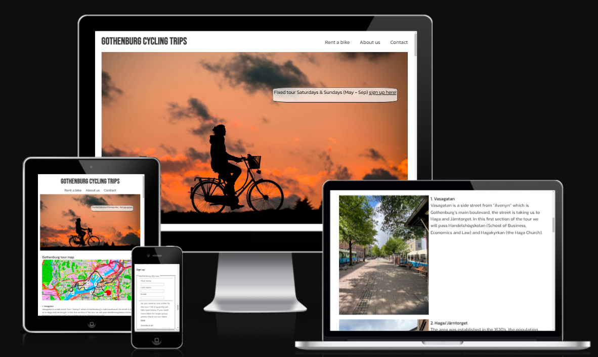
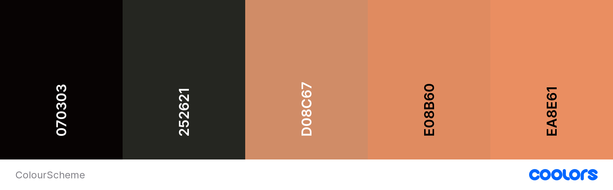
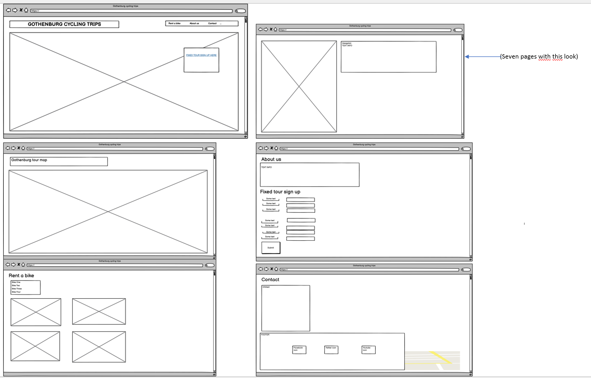
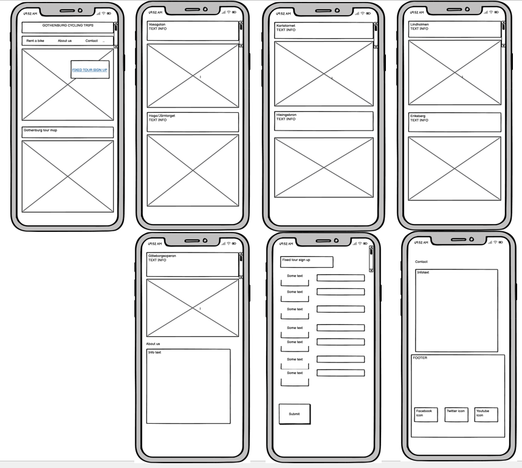

# GOTHENBURG CYCLING TRIPS

Gothenburg cycling trips is offering bike tours in Gothenburg city (Sweden), the background for creating this site is to promote an environmentally friendly and uncomplicated way to explore Gothenburg city for tourists or anyone enjoying bicycling. Furthermore, the target group could be anyone newly moved to Gothenburg wishing to make new acquaintances and would suit well for team-activities.

Link to the site:
[GOTHENBURG CYCLING TRIPS](https://bjornl1.github.io/cycling-gothenburg/)

## CONTENTS

- [GOTHENBURG CYCLING TRIPS](#gothenburg-cycling-trips)
  - [CONTENTS](#contents)
  - [User Experience (UX)](#user-experience-ux)
    - [User Stories](#user-stories)
  - [Design](#design)
    - [Colour Scheme](#colour-scheme)
    - [Typography](#typography)
    - [Imagery](#imagery)
    - [Wireframes](#wireframes)
  - [Features](#features)
    - [Future Implementations](#future-implementations)
    - [Accessibility](#accessibility)
  - [Technologies Used](#technologies-used)
    - [Languages Used](#languages-used)
    - [Frameworks, Libraries \& Programs Used](#frameworks-libraries--programs-used)
  - [Deployment \& Local Development](#deployment--local-development)
    - [Deployment](#deployment)
    - [Local Development](#local-development)
      - [How to Fork](#how-to-fork)
      - [How to Clone](#how-to-clone)
  - [Testing](#testing)
  - [Credits](#credits)
    - [Code Used](#code-used)
    - [Content](#content)
    - [Media](#media)
    - [Acknowledgments](#acknowledgments)

---

## User Experience (UX)

- __Initiation of concept__

Bicycling has becoming more popular recent years in Gothenburg, in combination with improving bike lanes, evolution of e-bikes and ambitious targets from local authorities to use environmentally friendly transportation solutions, a new market opportunity has been enabled. Gothenburg cycling trips can offer the potential increase for bike trips.

- __Key goals for the site__

- To offer a bike tour through the city by providing an easy accessibly website. 
- To offer a platform for social events and flexibility to adapt for customer/users input.

### User Stories

- __First time user:__
    I am:
  - Appreciating the website with a first impression of a well-balanced layout for information
  - Understanding the websites purpose and what services it offers.
  - Navigating easily to access the main functions.

- __Returning User:__
    I am:  
  - Establishing personal contact and should be able to give input to improve the site or service.
  - Exploring further options for bike tours well described in the about section.

## Design
### Colour Scheme
The landing page is the primary colour contributor to the website; hence the background is white in order the enhance the dominant colours in the hero image which is representing the long Nordic summer sunsets.

One of the main colours used in the hero image (#252621) was re-used for the footer as well, the colour is still clearly making a distinct difference compared to the contact section above it but keeping the theme consistent with the landing page. The colour scheme was created with [coolors](https://coolors.co/). 

### Typography        
The fonts chosen for the project is Babas Neue and Kanit with sans-serif as back up, these fonts are distinct but still with a soft edge matching the landing page content.
These fonts were imported with google fonts [Google Fonts](https://fonts.google.com/)

Kanit: for all content except the header title element (h1)
Babas Neue: for Header (h1)

### Imagery
The imagery is a fundamental aspect for the site, since the service provided is primarily bike tours, various images from the tour were included to let the user being able to properly view the main parts of the route thus improving the experience overall.

Images:
- Landing page and rent a bike section are from pexels.
- The gothenburg city map is from open street map.
- All other pictures are taken by me.

### Wireframes

Desktop wireframe

Mobile wireframe

## Features

- The website is comprised of 6 sections: 
 - Landing page
  - Navigation bar 
  - Separate link to access the sign up page directly
 - Bike tour content
 - About us
 - Fixed tour
 - Rent a bike
 - Contact

- Landing page
  -  The header and navigation bar are adapted with media queries, once viewed on a smaller device the navbar will be placed under the header and both header and navbar will be centered for promoting consistency in the display of the items and avoiding interference between them.

  - A link to the sign-up form is displayed close to top center, the purpose with the element is to draw attention to the link since it is standing out from the page and leading directly to link to sign up form for the users.

- Bike tour content
  - In this section the main content is presented to the user, it follows directly after the main page. The first image displayed is an overview of the Gothenburg city tour, the following content illustrates each tour section in the order following the route. For each image there is a brief description of the different stops that are included in the tour. For smaller screens, the content is displayed as a row the information text is followed by the image for each tour stop, by presenting the information in a row the image can be kept with a size making the image content clearly visible.

  - About Us. This section includes a subsection for the sign-up form for fixed tours. The first section is a description on the background of the webpage and what service is provided, after the introduction the subsection follows with the sign-up form.  
  - Fixed tour sign up form
    - In this form the user can submit a sign-up form to join the fixed tour, the form also includes a possibility to rent different bikes. The name and email fields are required to fill in whereas the bike field is optional, however there is set quantity between 1 to 5 bikes preventing the user to not adding copious quantities by mistake. Furthermore, there is a link to the rent a bike in the form field allowing the user to quickly check which bikes are available before sending the form.
    
- Rent a bike
  - This section includes the bikes provided by Gothenburg cycling trips, a table shows the cost for renting bike. Below the table, a paragraph is placed at the top of each bike image.
 On smaller screens the bike is adapted by a media query to display a row instead to fit the content properly.

- Contact
  - The contact section is including an address field but also phone and mail information, the latter is prepared with a link enabling the user to access a prepared mail link to improve accessibility. 

- A footer which contains social media links to Facebook, twitter, and YouTube. By using icons in the footer can be kept clean and because they are universally recognisable.

### Future Implementations
  - Use javascript to add a "to top" button with a solid smooth scroll function.  
  - Use javascript to add a confirmation pop-up window to allow the user to confirm the submitted form.
  - Create a database for the bikes in order to easliy control the number of bikes available and the repair status. 
  
### Accessibility

- I have been mindful during coding to ensure that the website is as accessible friendly as possible. I have achieved this by:
- Using semantic HTML.
- Added meta data characteristics for optimizing SEO.
- Using descriptive alt attributes on images on the site.
- Ensuring menus are accessible by underlining the nav links for screen readers.
- Using "hover" function on the sign up submit button.

## Technologies Used

### Languages Used
- HTML5
- CSS
### Frameworks, Libraries & Programs Used
- Balsamiq - Used to create wireframes.
- Git - For version control.
- Github - To save and store the files for the website.

- Google Fonts - To import the fonts used on the website.

- Font Awesome - For the iconography on the website.

- Google Dev Tools - To troubleshoot and test features, solve issues with responsiveness and styling.

- Tiny PNG - To compress images.

- Resize Pexel - To resize images and change to webp format.

- Favicon.io To create favicon.

- Am I Responsive? & Responsinator - To show the website image on a range of devices.

## Deployment & Local Development

The project was deployed using GitHub pages. The steps to deploy using GitHub pages are:

Go to the repository on GitHub.com
Select 'Settings' near the top of the page.
Select 'Pages' from the menu bar on the left of the page.
Under 'Source' select the 'Branch' dropdown menu and select the main branch.
Once selected, click the 'Save'.
Deployment should be confirmed by a message on a green background saying "Your site is published at" followed by the web address.

### Deployment

Include instructions here on how to deploy your project. For your first project you will most likely be using GitHub Pages.

### Local Development

#### How to Fork

- To fork the repository:

  - Log in (or sign up) to Github.
  - Go to the repository for this project, [cycling-gothenburg](https://github.com/BjornL1/cycling-gothenburg)
  - Click the Fork button in the top right corner.

#### How to Clone
- To clone the repository:

  - Log in (or sign up) to GitHub.
  - Go to the repository for this project,[cycling-gothenburg](https://github.com/BjornL1/cycling-gothenburg)
  - Click on the code button, select whether you would like to clone with HTTPS, SSH or GitHub CLI and copy the link shown.
  - Open the terminal in your code editor and change the current working directory to the location you want to use for the cloned directory.
  - Type 'git clone' into the terminal and then paste the link you copied in step 3. Press enter.

## Testing

- Validator Testing
  -  HTML
-   - No errors were returned when passing through the official W3C Markup Validator

- W3C Validator Results

-  CSS
 - No errors were found when passing through the official W3C CSS Validator
   

- Accessibility
 - The site achieved a Lighthouse accessibility score of 100%, see below picture from lighthouse testing.

- Form Testing
  - The form has been tested to ensure it would not submit without the required input fields being filled in (full name and email address).
 - It also checks that correct quantity is written in the rent a bike section of the form.

- Links Testing
 - All navigation links were tested manually to ensure the user is directed to the correct section of the website.

 - Social Media links in the footer of each page were tested manually to ensure they direct the user to the correct page and open in a new tab.

- Browser Testing
The Website was tested on Google Chrome, Firefox, Microsoft Edge, Safari browsers with no issues noted.

- Device Testing
The website was viewed on a variety of devices such as Laptop, iPhone 11, iPad to ensure responsiveness on various screen sizes. The website performed as intended. The responsive design was also checked using Chrome developer tools across multiple devices with structural integrity holding for the various sizes.

I also used the following website to test responsiveness:
- Responsinator
- Am I responsive

- Solved bugs
  - A problem with the footer was detected when trying to fixate it in the bottom of the page. At first it was possible to fixate it but then it covered other content above it. To solve it an instruction on a website had proper advice to on how to solve it by using the "flex-grow" which keeps the footer in the bottom of the page.

- Known Bugs/compromise
- A "to the top" button with a smooth behaviour would have been preferred to include in the site, however since I do not have any experience so far with JavaScript and judging from best practice to implement in a rational way java would be required, this is something I am currently unable to implement, but would like to add to the website in a future update.

## Credits
### Code Used

- Specific coding
  - For handling header and nav elements to make a column and center the website [adiati.com](https://adiati.com/how-to-create-a-responsive-navigation-bar-with-flexbox-and-media-queries) was an important contributor to solve the media query set up for smaller screens. In the section "Make The Navbar Responsive With Media Queries" partly the code shown was used in my website. The code can be found by searching on the class ". header-container" in the css file

 - General coding
   - For inspiration and tips the major sources were:
   - [W3 Schools](https://www.w3schools.com)
   - [Mozilla](https://developer.mozilla.org/en-US/docs/Learn)
  
### Content

The content is done by me, from idea to deployment.

### Media

- Pexels
- No author - Silhouette-of-person-riding-a-bike-during-sunset [hero image](https://www.pexels.com/photo/silhouette-of-person-riding-a-bike-during-sunset-37836/)
- Philipp M -  [Standard bike 28”](https://www.pexels.com/photo/black-and-white-hardtail-bike-on-brown-road-between-trees-100582/)
- Adam Dubec [Standard bike 26”](https://www.pexels.com/photo/red-cruiser-bike-1595476/)
- Abdulmomen Bsruki [Ebike 28”](https://www.pexels.com/sv-se/foto/gras-cykel-varumarke-produktfotografering-13989110/)
- Unsplash
- No author  [Ebike 26”](https://unsplash.com/photos/eh64UHZ2m5Y)

- [OpenStreetMap](https://www.openstreetmap.org/copyright) (Gothenburg tour map)
I like to link back to the source where I found the media, and include where on the site the image is used.
  
### Acknowledgments

- I would like to thank the following:
  - Antonio Rodriguez (mentor) for guidance and support. 
  - Slack community - for quick feedback on various questions
  - My family - for their patience with having me coding sometimes late evenings and nights.  
